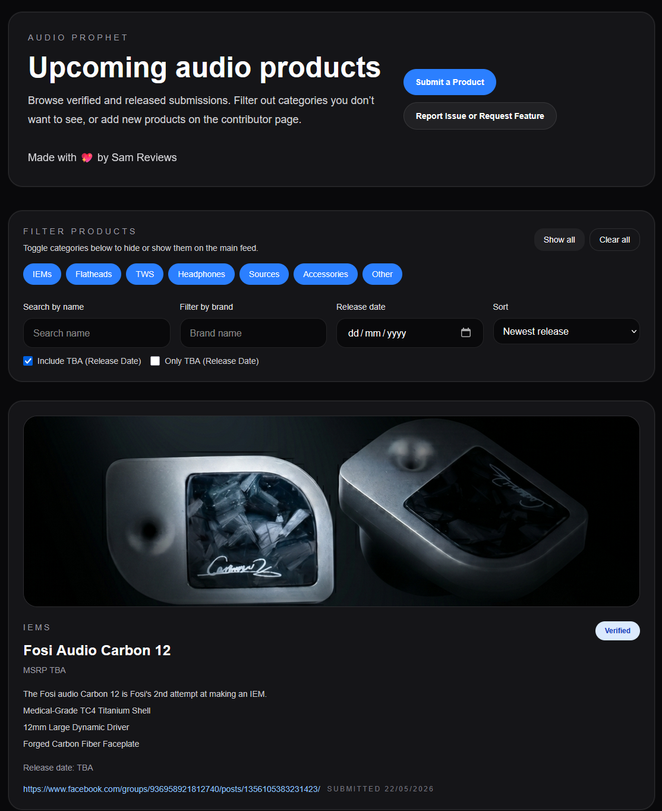
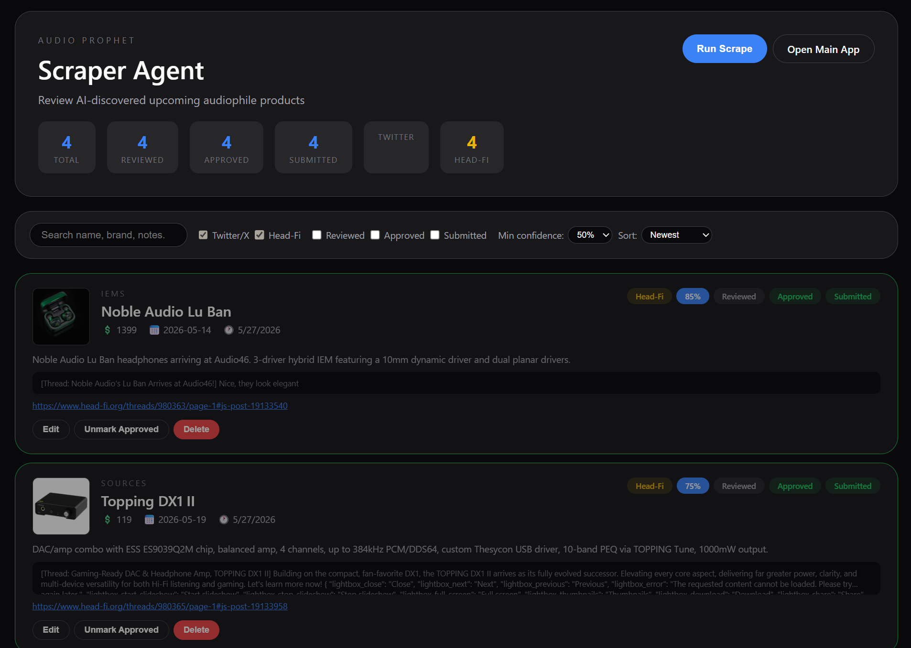
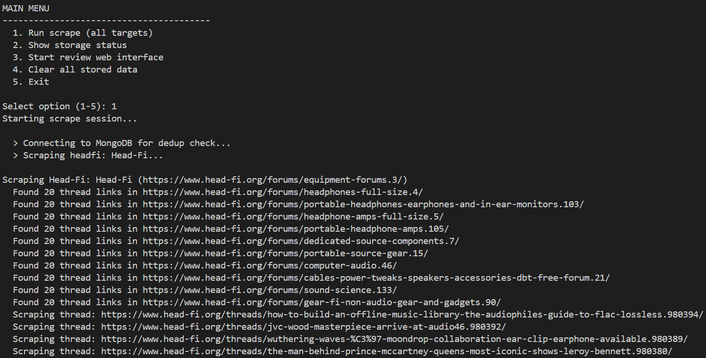
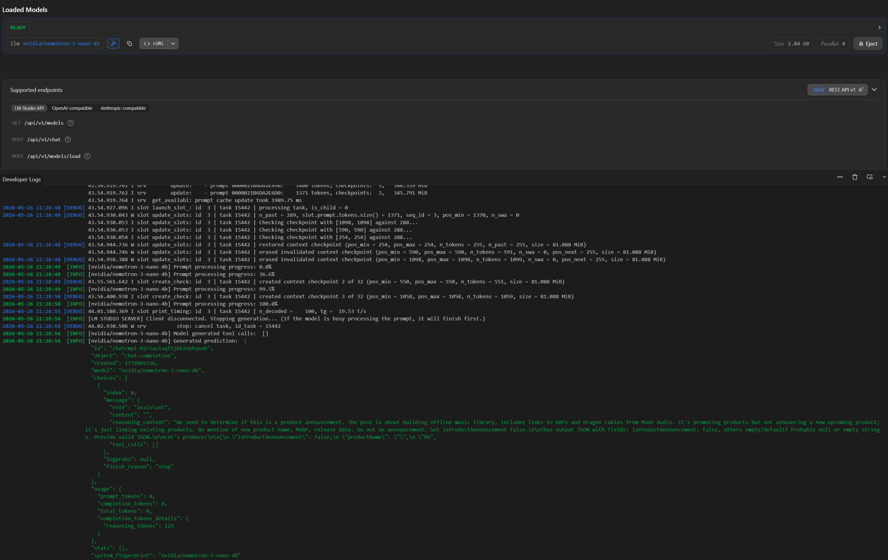

# AudioProphet

**The future of audiophile product discovery.**

A community-driven CMS that aggregates, AI-extracts, and showcases upcoming (yet-to-be-released) audiophile products -  from IEMs and headphones to DACs and desktop accessories.

[](https://nextjs.org)
[](https://react.dev)
[](https://www.typescriptlang.org)
[](https://tailwindcss.com)
[](https://mongodb.com)
[](#scraper-agent)




---

## Features

- **Product Browser** - Browse, filter (category, brand, price, date), search, and sort upcoming products with a clean dark-themed UI.
- **Community Submissions** - Users can submit product announcements with image upload, reCAPTCHA protection, and rate limiting.
- **Admin Panel** - Review, approve, reject, edit, and manage submissions with inline editing and bulk actions.
- **AI-Powered Scraper** - Autonomous agent scrapes Head-Fi, Twitter/X (Untested), and audiophile brand sites, then uses AI to extract structured product data.

---



## Scraper Agent

The `scraper-agent/` is a standalone Node.js/TypeScript application that **automates the discovery of upcoming products** using AI.

### How AI is used

1. **Scrape** - Playwright scrapes posts from Head-Fi forums, Twitter/X profiles, and general web sources.
2. **Analyze** - Each post is sent to an LLM (OpenAI or local LM Studio) with a system prompt that instructs it to detect product announcements and extract: product name, brand, category, MSRP, release date, and confidence score.
3. **Enrich** - Approved entries are enriched with Google Image search results.
4. **Review** - A built-in Express web UI lets you browse, edit, approve, and submit scraped products to the main app.

**Supported AI providers:**
| Provider | Model Config |
|---|---|
| **OpenAI** | `OPENAI_API_KEY` + any GPT model (JSON mode) |
| **LM Studio** | Local inference at `http://localhost:1234/v1` with models like `phi-3-mini-128k-instruct` or `nemotron-3-nano-4b` |

### Data Pipeline

```
Sources ──► Scrapers ──► AI Analysis ──► Validation ──► Review UI ──► Main App API ──► MongoDB
(Head-Fi,    (Playwright,   (OpenAI /         (dedup,       (Express        (Next.js
 Twitter/X,    Cheerio)       LM Studio)        confidence)    web app)        route)
 web)                                                                          │
                                                                     ┌──────────┘
                                                                     ▼
                                                                Direct MongoDB
                                                                (fallback if main
                                                                 app unreachable)
```


---

## Tech Stack

| Layer | Main App | Scraper Agent |
|---|---|---|
| **Framework** | Next.js 16 | Express |
| **Language** | TypeScript 5 | TypeScript 5 |
| **UI** | React 19 + Tailwind v4 | Vanilla HTML/CSS/JS |
| **Database** | MongoDB (native driver) | Local JSON + MongoDB (direct fallback) |
| **Scraping** | — | Playwright + Cheerio |
| **AI** | — | OpenAI SDK (cloud or local) |
| **Auth** | HTTP Basic + reCAPTCHA v3 | — |
| **Deployment** | Vercel | Standalone |

---

## Getting Started

### Prerequisites

- Node.js >= 20
- MongoDB instance (local or Atlas)
- (Optional) OpenAI API key or LM Studio running locally

### Main App

```bash
# Install dependencies
npm install

# Set up environment
cp .env.local.example .env.local
# Edit .env.local with your MongoDB URI, admin credentials,
# reCAPTCHA keys, and SCRAPER_API_KEY (must match scraper-agent/.env)

# Run development server
npm run dev
```

Open [http://localhost:3000](http://localhost:3000).

### Scraper Agent

```bash
cd scraper-agent
npm install
cp .env.example .env
# Edit .env with your AI provider settings, MongoDB URI, and SCRAPER_API_KEY

# Make sure SCRAPER_API_KEY matches in both scraper-agent/.env and root .env.local

# Run the scraper
npm run dev

# After npm install, you can directly run the following without cd-ing into scraper-agent (from audio-prophet)
npm run scraper dev
```

The review UI will be available at [http://localhost:4000](http://localhost:4000).

**Submitting to the main app:** When you approve a product in the review UI and click "Submit to App", the scraper-agent first tries the main app's API at `APP_URL`. If the main app isn't running, it falls back to writing directly to MongoDB (using the `MONGODB_URI` from `scraper-agent/.env`).

---

## Project Structure

```
.
├── app/                 # Next.js App Router (pages, API routes)
│   ├── page.tsx         # Product browser
│   ├── submissions/     # Submission form
│   └── admin/           # Admin review panel
├── lib/                 # MongoDB connection & TypeScript types
├── src/                 # Shared utilities (validation, search)
├── data/                # Local JSON storage (products, rate limits)
└── scraper-agent/       # AI-powered scraping pipeline
    ├── src/
    │   ├── scrapers/    # Head-Fi, Twitter/X, Web scrapers
    │   ├── ai.ts        # OpenAI / LM Studio integration
    │   ├── submitter.ts # Main app submission with MongoDB fallback
    │   ├── config.ts    # Environment config loader
    │   └── enricher/    # Google image search enrichment
    └── web/             # Review UI (Express + vanilla frontend)
```

---

## Links

- **Live site** — [https://audio-prophet.vercel.app/](https://audio-prophet.vercel.app/)
- **Discord** — [Join the community](https://discord.gg/wG4RgWQNUu)
